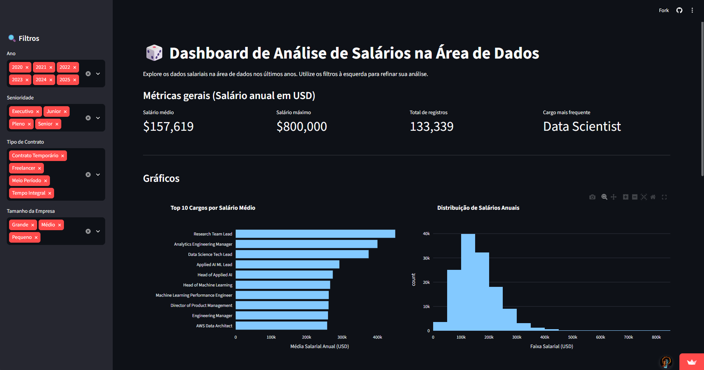

# 📊 Alura - Imersão Dados com Python II

Dashboard interativo, construído com **Streamlit** e **Plotly**, para explorar dados salariais na área de Dados. O projeto permite filtrar registros por ano, senioridade, tipo de contrato e tamanho da empresa, exibindo métricas e gráficos que ajudam a entender o cenário salarial do setor.

🔗 **Aplicação online:** [alura-imersao-dados-python-ii-2026.streamlit.app](https://alura-imersao-dados-python-ii-2026.streamlit.app/)

> Projeto desenvolvido durante a **Imersão Dados com Python** da [Alura](https://www.alura.com.br/).

---

## 🗂️ Sumário

- [Sobre o projeto](#-sobre-o-projeto)
- [Funcionalidades](#-funcionalidades)
- [Prévia](#-prévia)
- [Tecnologias utilizadas](#-tecnologias-utilizadas)
- [Estrutura do projeto](#-estrutura-do-projeto)
- [Base de dados](#-base-de-dados)
- [Como executar localmente](#-como-executar-localmente)
- [Deploy](#-deploy)
- [Autor](#-autor)
- [Licença](#-licença)

---

## 📌 Sobre o projeto

O objetivo deste projeto é transformar uma base de dados salariais da área de Dados em um **dashboard interativo**, onde é possível:

- Explorar como o salário varia de acordo com senioridade, cargo, contrato e tamanho da empresa;
- Visualizar tendências ao longo dos anos disponíveis na base;
- Comparar a distribuição salarial entre diferentes países e tipos de trabalho (remoto, híbrido ou presencial).

A aplicação foi construída em Python, usando **Streamlit** para a interface web e **Plotly Express** para os gráficos interativos.

---

## ✨ Funcionalidades

- **Filtros dinâmicos** na barra lateral:
  - Ano
  - Senioridade
  - Tipo de contrato
  - Tamanho da empresa
- **Indicadores (KPIs)**:
  - Salário médio (USD)
  - Salário máximo (USD)
  - Total de registros filtrados
  - Cargo mais frequente
- **Gráficos interativos**:
  - Top 10 cargos por salário médio (barras horizontais)
  - Distribuição de salários anuais (histograma)
  - Proporção dos tipos de trabalho — remoto/híbrido/presencial (gráfico de pizza/donut)
  - Salário médio de Cientista de Dados por país (mapa coroplético)
- **Tabela de dados detalhados** com os registros filtrados

---

## 🖼️ Prévia



---

## 🛠️ Tecnologias utilizadas

| Tecnologia | Função |
|---|---|
| [Python](https://www.python.org/) | Linguagem principal do projeto |
| [Streamlit](https://streamlit.io/) | Construção da interface web interativa |
| [Pandas](https://pandas.pydata.org/) | Manipulação e filtragem dos dados |
| [Plotly Express](https://plotly.com/python/plotly-express/) | Criação dos gráficos interativos |

Versões mínimas (ver `requirements.txt`):

```
pandas>=2.3.0
streamlit>=1.45.0
plotly>=5.24.0
```

---

## 📁 Estrutura do projeto

```
alura-imersao_dados_python_ii/
│
├── app.py                     # Aplicação Streamlit (dashboard)
├── dados-imersao-final.csv    # Base de dados utilizada no dashboard
├── requirements.txt           # Dependências do projeto
├── .gitignore
└── README.md
```

---

## 🧾 Base de dados

O arquivo `dados-imersao-final.csv` contém os registros salariais utilizados pela aplicação. Colunas usadas pelo dashboard:

| Coluna | Descrição |
|---|---|
| `ano` | Ano de referência do salário |
| `senioridade` | Nível de senioridade do profissional |
| `contrato` | Tipo de contrato de trabalho |
| `tamanho_empresa` | Porte da empresa |
| `cargo` | Cargo/posição do profissional |
| `usd` | Salário anual convertido para USD |
| `remoto` | Modalidade de trabalho (remoto/híbrido/presencial) |
| `residencia_iso3` | Código ISO3 do país de residência |

> Caso a base tenha colunas adicionais não usadas no dashboard, elas simplesmente não aparecem nos filtros/gráficos, mas continuam visíveis na tabela de dados detalhados.

---

## 🚀 Como executar localmente

### Pré-requisitos

- Python 3.9 ou superior
- pip

### Passo a passo

1. Clone o repositório:

```bash
git clone https://github.com/danieljotasilva/alura-imersao_dados_python_ii.git
cd alura-imersao_dados_python_ii
```

2. (Opcional, mas recomendado) Crie um ambiente virtual:

```bash
python -m venv venv
source venv/bin/activate    # Linux/Mac
venv\Scripts\activate       # Windows
```

3. Instale as dependências:

```bash
pip install -r requirements.txt
```

4. Execute a aplicação:

```bash
streamlit run app.py
```

5. Acesse no navegador o endereço indicado pelo Streamlit (geralmente `http://localhost:8501`).

---

## ☁️ Deploy

A aplicação está publicada no **Streamlit Community Cloud** e pode ser acessada em:

👉 https://alura-imersao-dados-python-ii-2026.streamlit.app/

Para publicar sua própria versão:

1. Faça um fork deste repositório.
2. Acesse [share.streamlit.io](https://share.streamlit.io/).
3. Conecte sua conta do GitHub e selecione o repositório.
4. Defina `app.py` como arquivo principal e faça o deploy.

---

## 👤 Autor

Desenvolvido por **Daniel João da Silva** como parte da Imersão Dados com Python (Alura).

- GitHub: [@danieljotasilva](https://github.com/danieljotasilva)

---

## 📄 Licença

Este projeto não possui uma licença definida no repositório original. Se desejar, adicione um arquivo `LICENSE` (por exemplo, [MIT](https://choosealicense.com/licenses/mit/)) para deixar claro como o código pode ser usado e distribuído.